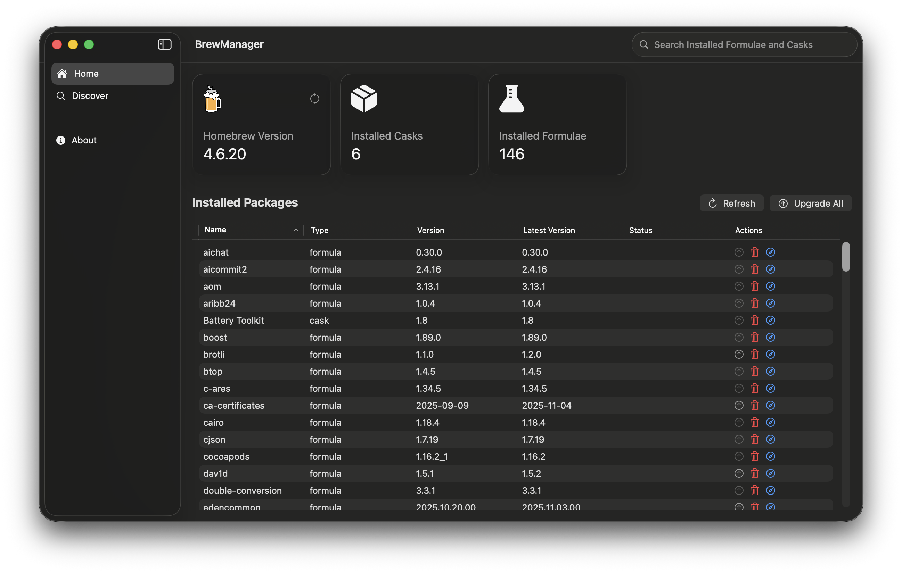
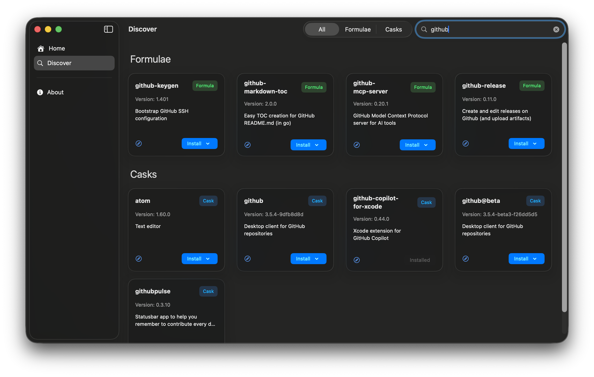

<p align="center">
    
</p>

<h1 align="center">BrewManager</h1>
<p align="center">
<a href="https://developer.apple.com/xcode/swiftui/">
  
</a>
<a href="https://github.com/Mohanedy/brew-manager/blob/main/LICENSE">

</a>
<a href="https://github.com/mohanedy/brew-manager/actions/workflows/release.yaml">

</a>

BrewManager is a macOS application that provides a user-friendly interface for managing Homebrew formulae, and casks. It simplifies the process of installing, updating, and removing Homebrew packages on your Mac.

## Screenshots

<p align="center">
<a href="./assets/brewmanager-1.png"></a>
<a href="./assets/brewmanager-2.png"></a>
</p>

## Features

- [x] Simple and User-Friendly Interface with Liquid glass support and light/dark mode.
- [x] Install, Update, and Remove Homebrew Formulae and Casks.
- [x] View Installed Packages and Available Updates.
- [x] Search for Installed Packages and Casks.
- [x] View Package Details including version, description, and installation status.
- [ ] Have a menu bar app for quick access to installed packages and updates.
- [ ] Support for managing Homebrew taps.
- [ ] Notifications for available updates.

## Installation

You can download the latest release of BrewManager from the [Releases](https://github.com/Mohanedy/brew-manager/releases) page. This will download a file called `BrewManager.dmg`. Open it and move the app to the application folder.

The app may be blocked by macOS Gatekeeper since it is not from the App Store. To open it:

1. Open System Preferences.
2. Go to Privacy & Security.
3. In the Security section, you should see a message about BrewManager being blocked. Click "Open Anyway".
4. Confirm that you want to open the app.

## Building from Source

To build BrewManager from source, you need to have Xcode installed on your Mac. Follow these steps:

1. Clone the repository:

   ```bash
   git clone https://github.com/Mohanedy/brew-manager.git
   cd brew-manager
    ```

1. Open the `BrewManager.xcodeproj` file in Xcode.
1. Select the `BrewManager` target and choose your desired build scheme (e.g., Debug or Release).
1. Build and run the project using Xcode.

## Requirements

- macOS 26.0 or later
- Xcode 26.0 or later
- Mac with only Apple Silicon (M1, M2, etc.) processors
- Homebrew installed on your system

## Contributing

Contributions are welcome! If you find a bug or have a feature request, please open an issue on the [GitHub Issues](https://github.com/Mohanedy/brew-manager/issues) page.

If you would like to contribute code, please fork the repository and create a pull request with your changes.

## Thanks

Special thanks to the developers of the following open-source projects that made BrewManager possible:

- [Homebrew](https://brew.sh/)
- [Sparkle](https://sparkle-project.org/)
- [TCA](https://github.com/pointfreeco/swift-composable-architecture)

## License

BrewManager is licensed under the MIT License. See the [LICENSE](LICENSE) file for more information.
